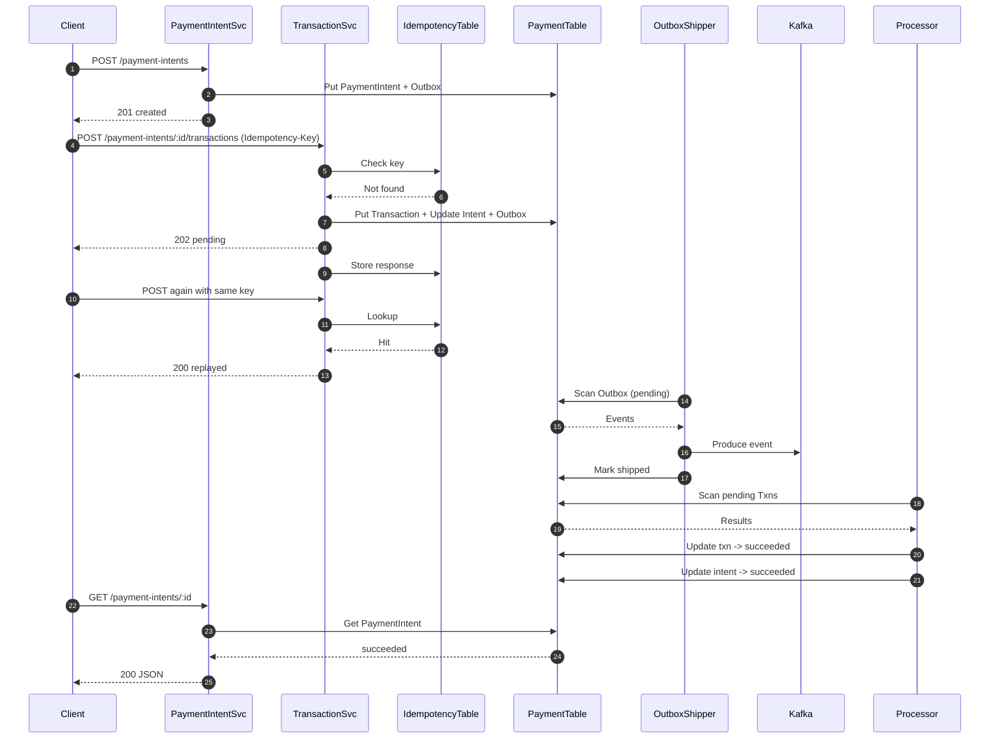

# Payment
Payment Service Sandbox

# Payment System Flow (End-to-End) - Local Test / Sandbox

```mermaid
sequenceDiagram
autonumber
participant Client
participant PI as PaymentIntentSvc
participant TX as TransactionSvc
participant IDEM as IdempotencyTable
participant DB as PaymentTable
participant SHIP as OutboxShipper
participant KAFKA as Kafka
participant PROC as Processor

Client->>PI: POST /payment-intents
PI->>DB: Put PaymentIntent + Outbox
PI-->>Client: 201 created

Client->>TX: POST /payment-intents/:id/transactions (Idempotency-Key)
TX->>IDEM: Check key
IDEM-->>TX: Not found
TX->>DB: Put Transaction + Update Intent + Outbox
TX-->>Client: 202 pending
TX->>IDEM: Store response

Client->>TX: POST again with same key
TX->>IDEM: Lookup
IDEM-->>TX: Hit
TX-->>Client: 200 replayed

SHIP->>DB: Scan Outbox (pending)
DB-->>SHIP: Events
SHIP->>KAFKA: Produce event
SHIP->>DB: Mark shipped

PROC->>DB: Scan pending Txns
DB-->>PROC: Results
PROC->>DB: Update txn -> succeeded
PROC->>DB: Update intent -> succeeded

Client->>PI: GET /payment-intents/:id
PI->>DB: Get PaymentIntent
DB-->>PI: succeeded
PI-->>Client: 200 JSON
```
