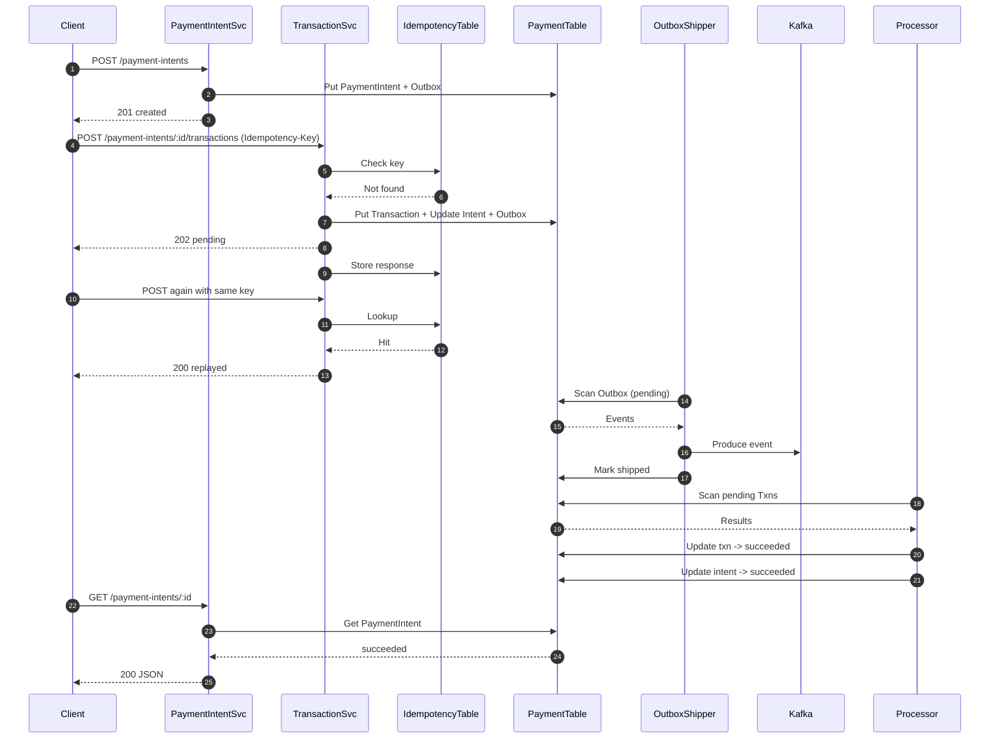

# Payment
Payment Service Sandbox

# Objective
Implement a Payment Service that:
## Core Requirements 

Merchants should be able to initiate payment requests (charge a customer for a specific amount). 
Users should be able to pay for products with credit/debit cards. Merchants should be able to view status updates for payments (e.g., pending, success, failed). 
## Below the line (out of scope): 
Customers should be able to save payment methods for future use. Merchants should be able to issue full or partial refunds. Merchants should be able to view transaction history and reports. Support for alternative payment methods (e.g., bank transfers, digital wallets). Handling recurring payments (subscriptions). Payouts to merchants.

# Payment System Flow (End-to-End) - Local Test / Sandbox

